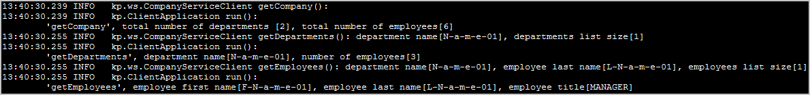

<!DOCTYPE html>
<HTML>
<HEAD>
	<META charset="UTF-8">
</HEAD>
<BODY>

<H2 id="contents">Study06 README Contents</H2>
<H3>Research SOAP Web Services</H3>

Java source code: 
 
 server package
	<a href="https://github.com/ee-eng-cs/Study06/tree/master/soap-ws-server/src/main/java/kp/">kp</a>  
 client package
	<a href="https://github.com/ee-eng-cs/Study06/tree/master/soap-ws-client/src/main/java/kp/">kp</a>  

The example uses Spring Boot and Spring Web Services.

Creating SOAP Web Services on server:
<UL>
   <LI>Generate Java classes (with XJC) from XML schema file
       <a href="https://github.com/ee-eng-cs/Study06/tree/master/soap-ws-server/src/main/resources/company.xsd">company.xsd</a>.</LI>
   <LI>Export this XSD file (with Spring-WS) as a WSDL 1.1.</LI>
</UL>

Creating SOAP Web Services on client:
<UL>
   <LI>Generate Java classes (with JAXB) from WSDL
       <A HREF="http://localhost:8080/ws/company.wsdl">http://localhost:8080/ws/company.wsdl</A>.</LI>
</UL>

Spring Web Services limitations: 
XSD-based generation only supported for WSDL 1.1 and 
Spring-WS only supports the contract-first development style

Actions: 
 
 1. With batch file <I>"01 MVN (server) run.bat"</I> start the server. 
 2. With batch file <I>"02 MVN (client) run.bat"</I> execute the client application. 
 3. With batch file <I>"03 CURL call server.bat"</I> execute the <B>curl</B> requests to the server. 
 4. In web browser get WSDL from <A HREF="http://localhost:8080/ws/company.wsdl">http://localhost:8080/ws/company.wsdl</A>. 

 
<I>Second action result: console log from client call.</I>

		

 
<I>Second action result: console log from server.</I>

<H3>Application Tests</H3>
<OL>
  <LI>The server tests with <B>WebServiceTemplate</B>.</LI>
  <LI>The server tests with <B>MockWebServiceClient</B>.</LI>
  <LI>The client tests with <B>MockWebServiceServer</B>.</LI>
</OL>

<A href="apidocs/index.html?overview-summary.html" >API Specifications</A>
(API was not commited to <B>GitHub</B>; this link should be active after local build with <I>'mvn javadoc'</I>)

</BODY>
</HTML>